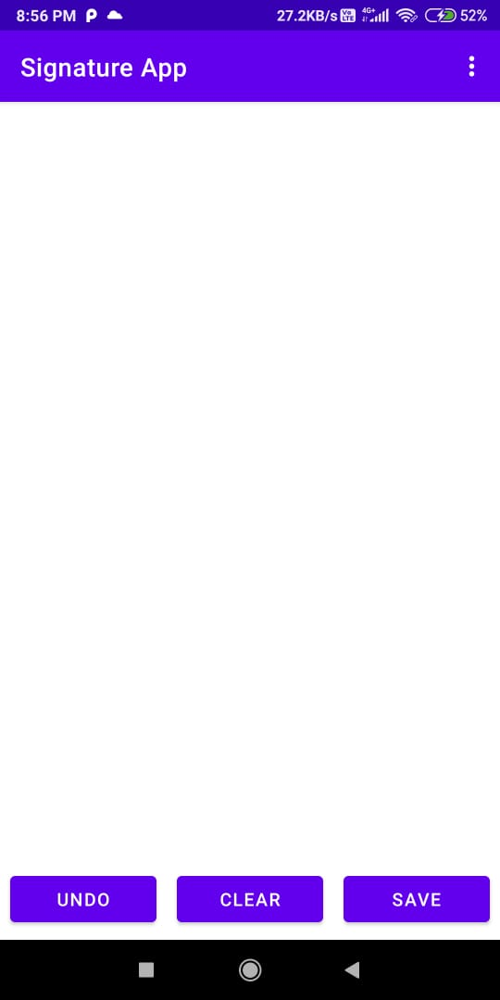
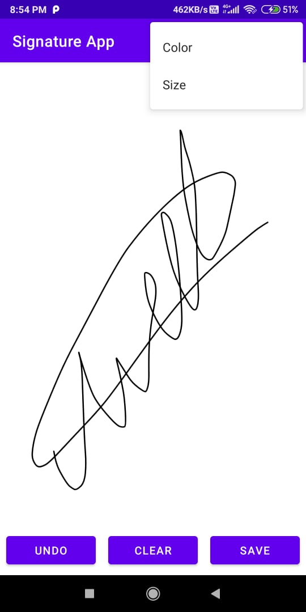
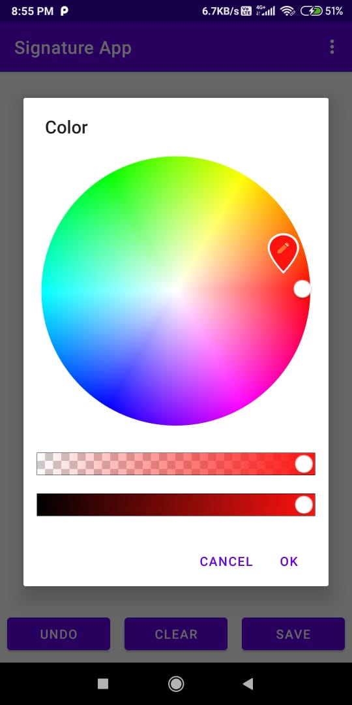
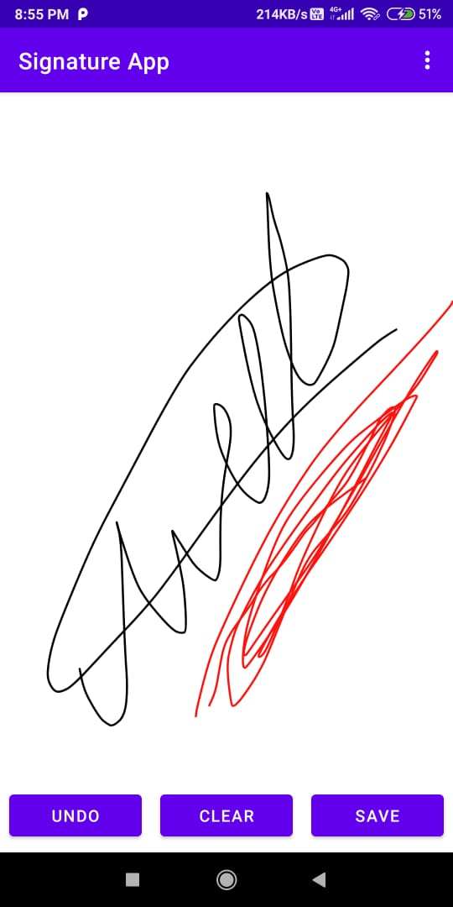
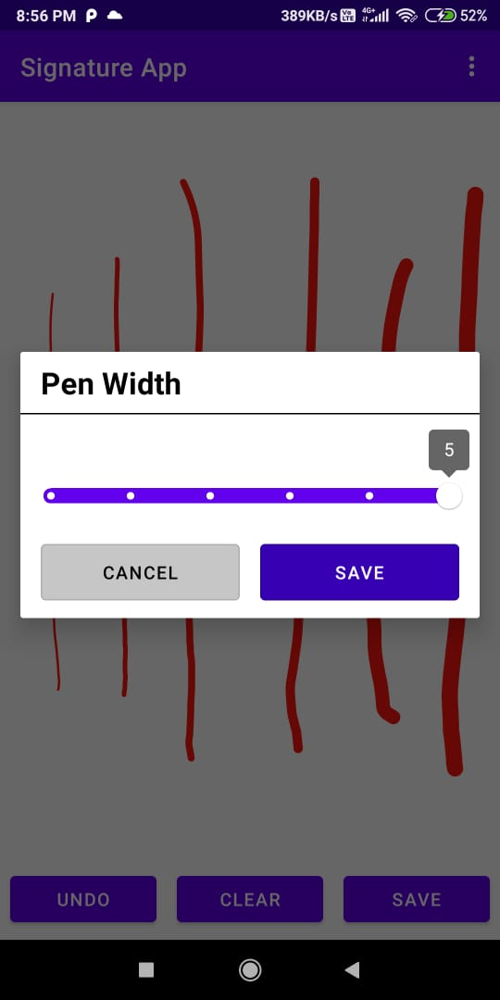
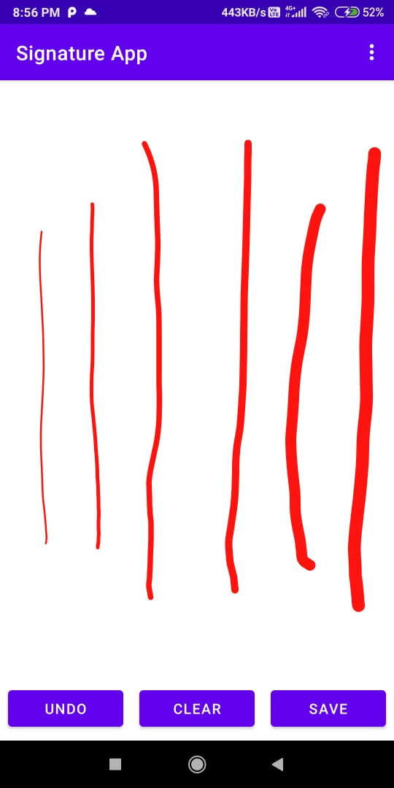
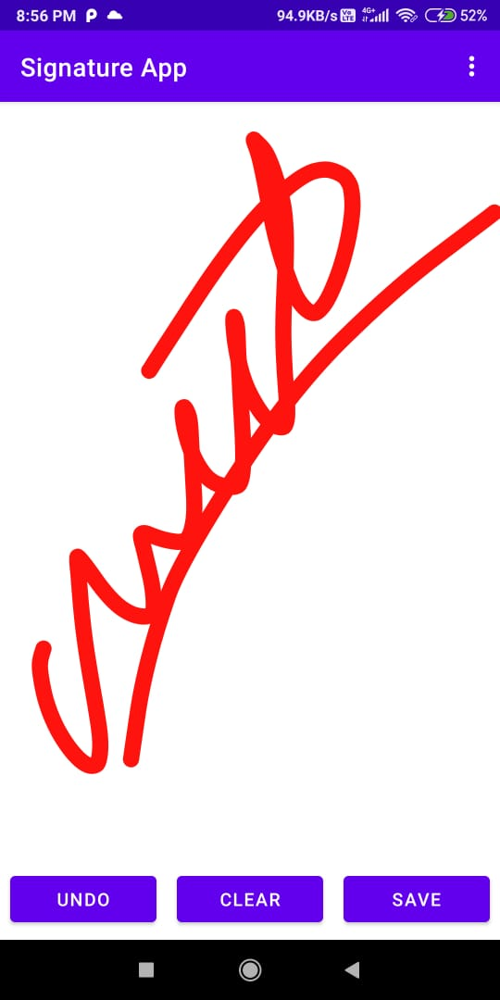
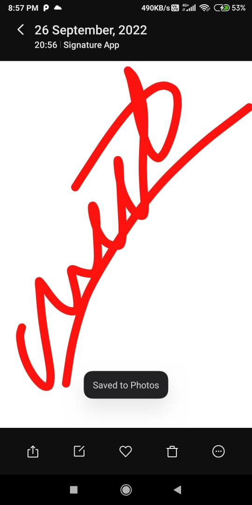
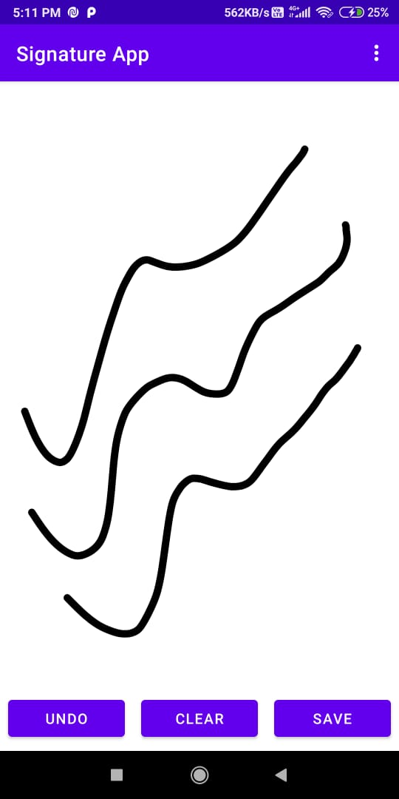
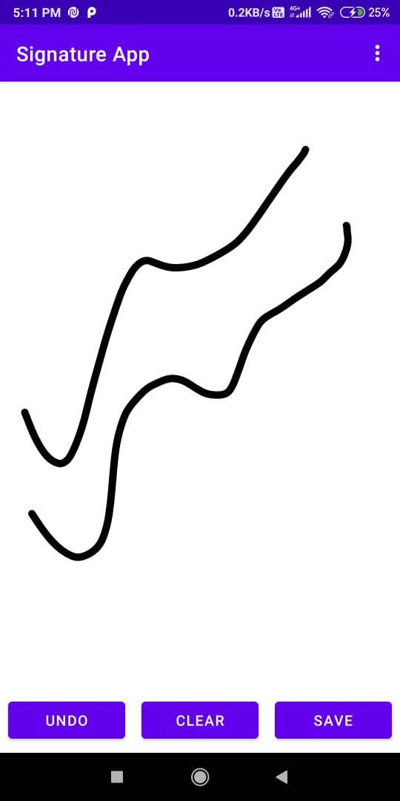

# Signature-App

# Screenshot

Choose the colour of the pen

  
  

Choose the size of the pen point

  

Save the signature as a image (jpeg, jpg, png)

Clear feature

 

Undo feature

 

